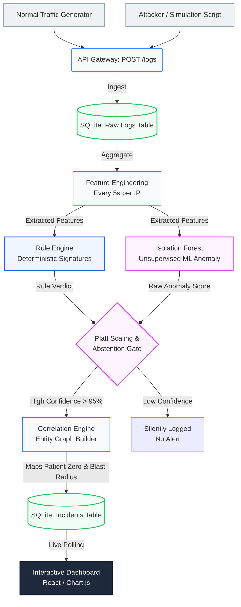

# Presentation Guide: Cross-Layer Threat Detection Platform

This document is your complete script and guide for presenting your major project to the faculty. It is written in plain language so that anyone—even those without a strong cybersecurity or machine learning background—can understand exactly what you built, why it matters, and how it works.

---

## 1. The "Elevator Pitch" (If you only have 30 seconds)

> *"In modern cybersecurity, the problem isn't detecting attacks—it's that analysts are drowned in thousands of false alarms every day. Most security systems just dump raw logs onto a screen.*
>
> *I built an intelligent platform that reads web traffic in real time, uses a hybrid of **Hard Rules** and **Machine Learning** to spot anomalies, and then mathematically groups those anomalies into a single, easy-to-read **Incident Graph**. Instead of handing an analyst 500 alerts, my system hands them 1 correlated story."*

---

## 2. What We Upgraded (Why this is a Major Project)

When this project started, it was a basic script that caught simple brute-force attacks. We upgraded it into a full enterprise-grade architecture based on a professional Threat Attribution design. 

Here is exactly what we added to make it notable:
1. **Unsupervised Machine Learning:** Added an `IsolationForest` model that learns what "normal" traffic looks like on its own, catching zero-day attacks that bypass static rules.
2. **Platt Scaling (The Abstention Gate):** Raw ML models guess too often. We added complex math (logistic sigmoid calibration) to convert raw ML scores into true percentages. If the ML is only 75% confident, the system **abstains** from alerting to prevent false-positive fatigue.
3. **Graph Correlation:** Instead of treating every bad login as a separate alert, we built an engine that links them together by IP and Time, identifying **"Patient Zero"** and calculating the **"Blast Radius"**.
4. **One-Click UI Dashboard:** Replaced the terminal console with a professional React-style interface that allows you to trigger simulations with a single click.

---

## 3. Step-by-Step Workflow: How the System Works

If the faculty asks, *"How does a log become an incident on this dashboard?"*, walk them through these 6 steps:

### Step 1: Real-Time Ingestion
The system acts as a listener (`POST /logs`). It constantly receives raw server logs (IP address, endpoint, status code, bytes transferred) as fast as they happen.

### Step 2: Feature Engineering (The 5-Second Window)
Raw text logs are useless to a Machine Learning model. Every 5 seconds, the system groups all traffic by IP address and converts it into 5 mathematical features:
- **Request Count** (Volume)
- **Failure Rate** (Are they guessing passwords?)
- **Unique Endpoints** (Are they scanning the site?)
- **Average Interarrival Time** (Is it a bot acting too fast?)
- **Total Bytes** (Are they downloading a massive database?)

### Step 3: Hybrid Detection (Rules + ML)
These 5 numbers are fed into **two** engines simultaneously:
- **The Rule Engine:** Checks for known signatures (e.g., `req_count > 50` is a DoS flood). It is fast and deterministic.
- **The ML Engine:** Checks if the behavior is mathematically strange compared to normal traffic.

### Step 4: The Abstention Gate
The scores from both engines are fused together. To prevent "alert fatigue", the system requires a 95% confidence score to raise a red flag. If it is suspicious but not definitively an attack, the system logs it silently but **abstains** from interrupting the human analyst.

### Step 5: Correlation & Attribution
Once an alert is confirmed, it isn't just thrown on the screen. The Correlation Engine looks at recent history and builds a **Topological Graph**. It groups the alerts, identifies the starting IP (**Patient Zero**), maps it to the **MITRE ATT&CK Framework** (e.g., Credential Access), and packages it into a single `Incident`.

### Step 6: Visualization
The Incident is pushed live to the Dashboard, drawing a visual Kill Chain graph for the analyst to read instantly.

---

## 4. How the Machine Learning Actually Works

If a faculty member asks: *"How does the ML detect suspicious logs without being trained on virus data?"*

> *"I am using **Unsupervised Machine Learning**, specifically an algorithm called **Isolation Forest**. 
> 
> Because hackers invent new attacks every day, I can't train a model on 'known attacks'. Instead, my model is trained purely on **Normal Traffic**. It draws a mathematical boundary around what a normal user looks like. 
> 
> When traffic arrives, the model calculates how many 'splits' it takes to isolate that IP from the rest of the group. If an IP is doing something highly unusual—even if it's an attack the world has never seen before—it falls outside the boundary and is flagged as an anomaly. The model continuously retrains itself every 60 seconds on clean traffic to adapt to new user behaviors."*

---

## 5. How to Run the Presentation Demo

During your presentation, you only need to run one command in your terminal:
```bash
uvicorn app.main:app --reload
```
Then, open your browser to `http://127.0.0.1:8000`.

**The Demonstration Steps:**
1. Point to the **Simulation Controls** at the top of the dashboard.
2. Click **Normal Traffic**. Show the faculty the blue line graph moving, but explain that *Active Incidents remains 0* because the system knows it is benign.
3. Click **Multi-Stage Attack**. Wait ~30 seconds.
4. Point to the **Incident Card** that appears. 
5. Say: *"Instead of 7 different raw alerts, the system grouped them into a single Incident. It identified Patient Zero, calculated that 2 endpoints were compromised in the Blast Radius, and mapped the attack to the MITRE Kill Chain (Credential Access -> Impact)."*
6. Click **Reset Demo** when you are done.

---

## 6. End-to-End System Architecture Diagram

*(This diagram shows the complete data flow from the moment a log is generated to the moment it appears on the dashboard.)*


